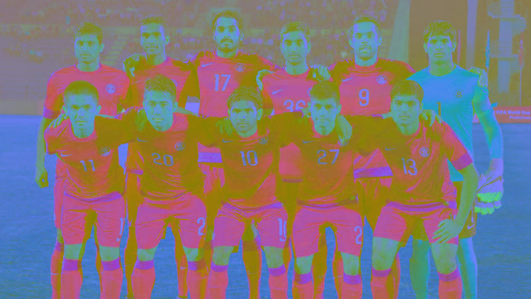
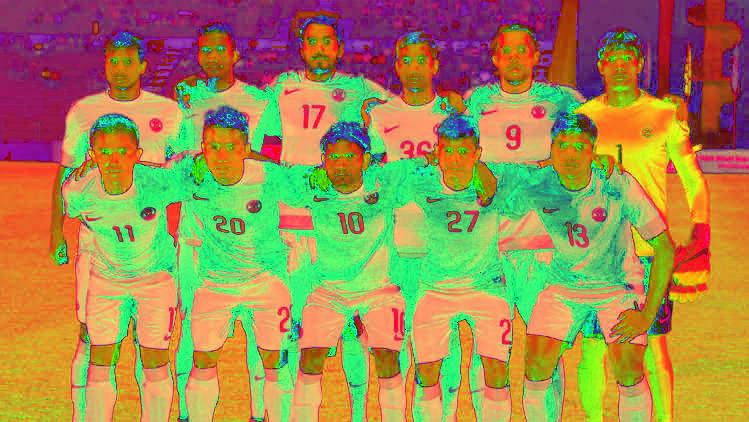
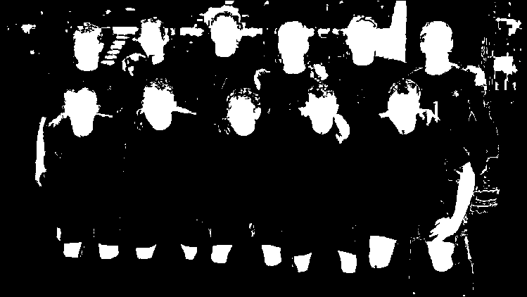
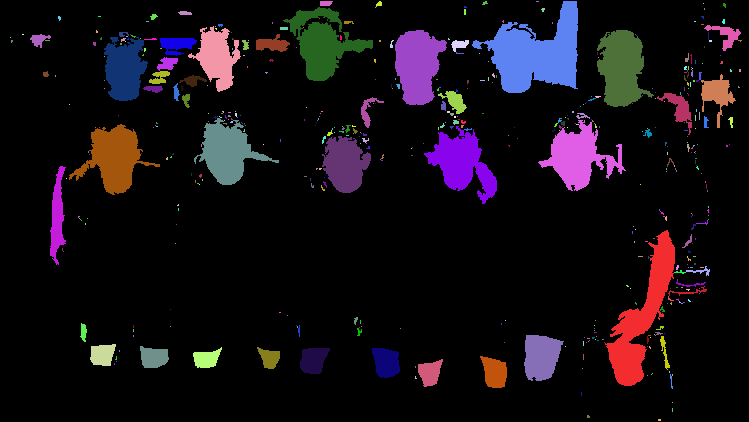
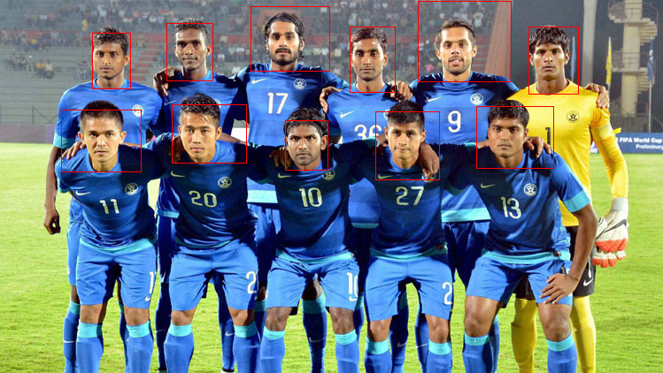
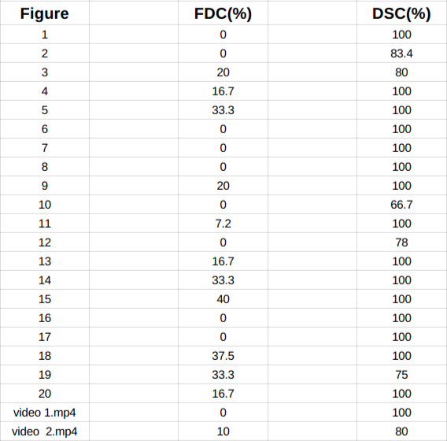

<html><head><meta content="text/html; charset=UTF-8" http-equiv="content-type">

</head><body class="c26">

&nbsp;

&nbsp; &nbsp; &nbsp; &nbsp; &nbsp; PROJECT REPORT

&nbsp;&nbsp;&nbsp;&nbsp;&nbsp;&nbsp;&nbsp;&nbsp;&nbsp;&nbsp;&nbsp;&nbsp;&nbsp;&nbsp;&nbsp;&nbsp;&nbsp;&nbsp;&nbsp;&nbsp;&nbsp;&nbsp;&nbsp;&nbsp;&nbsp;&nbsp;&nbsp;&nbsp;&nbsp;&nbsp;&nbsp;&nbsp;&nbsp;Dt.20-11-2016

&nbsp;&nbsp;&nbsp;&nbsp;&nbsp;&nbsp;&nbsp;&nbsp;&nbsp;&nbsp;&nbsp;&nbsp;&nbsp;&nbsp;&nbsp;&nbsp;&nbsp; &nbsp;CS 663&nbsp;&nbsp;&nbsp;&nbsp;&nbsp;&nbsp;&nbsp;&nbsp;

&nbsp; &nbsp;

Detection of faces by detecting regions of skin from color images

(Implemented in C++ - opencv2)

SURYA TEJ - 140050055

SRINIVAS NAIK BHUKYA - 140050064

CHAITANYA RAJESH BANALA - 140050073

Problem Statement :

Detection of faces by detecting regions of skin from color images.We extended this to also use 

(i) webcam for live face detection 

(ii) any video properly formatted

(iii) a color image

Usage is mentioned in README.

Motivation :

Detection of the human face is very useful in automatic face recognition, video surveillance, human-computer communication and large-scale face image retrieval systems. The first and foremost important step in any of these systems is the accurate detection of the presence and the position of the human faces in an image or video.

Overview:
<ul class="c13 lst-kix_pkq6t7c2w9j-0 start"><li class="c2">The algorithm uses a combination of RGB-HS-CbCr color spaces for the detection of &nbsp;human faces. Skin regions are extracted using a set of bounding rules based on the skin color distribution obtained from a training set.</li><li class="c2">The model we have used utilizes the additional hue and chrominance information of the image on top of standard RGB properties to properly differentiate between skin pixels and non-skin pixels.</li><li class="c2">Two region properties Face Detection phase &ndash; box ratio and eccentricity were used to classify the shape of each skin region after getting skin detected part of the image to report if it is face region or not. </li><li class="c2">This project is done in C++ using opencv libraries.We did not use any direct existing libraries for face detection.</li></ul>

Procedure:

The procedure involves two main steps :

(i) Skin Detection

(ii) Face Detection using the skin detected intermediate result obtained from step (i)

The procedure is explained using a sample image and applying operations on it.The basic algorithm we used is same as the one explained in research paper (mentioned in references section).But In the report we tried to explain the algo using the code we have written.

Let us take a sample image 

Skin Detection&nbsp;:
<ul class="c13 lst-kix_jkgjlj1ttztq-0 start"><li class="c2">The given image is in RGB color space, first step is to get two more color spaces YCrCb and HSV of the image. We use these color-spaces to get the intensities of pixels in all the color spaces and mark the pixels as skin pixel using those values.</li></ul>
&nbsp;&nbsp;&nbsp;&nbsp;&nbsp;&nbsp;&nbsp;&nbsp;We do this by using the functions :

&nbsp;&nbsp;&nbsp;&nbsp;&nbsp;&nbsp;&nbsp;&nbsp;cvtColor(input,ycrcbimg,cv::COLOR_BGR2YCrCb)

&nbsp; &nbsp; `&nbsp;&nbsp;&nbsp;&nbsp;&nbsp;&nbsp;&nbsp;&nbsp;cvtColor(input,hsvimg,CV_BGR2HSV)

YCrCb color space&nbsp;&nbsp;&nbsp;&nbsp;&nbsp;&nbsp;&nbsp;&nbsp;&nbsp;&nbsp;&nbsp;&nbsp;&nbsp;&nbsp;&nbsp;&nbsp;&nbsp;&nbsp;&nbsp;&nbsp;&nbsp;&nbsp;&nbsp;&nbsp;&nbsp;&nbsp;&nbsp;&nbsp;&nbsp;&nbsp;&nbsp;&nbsp;HSV color space

<ul class="c13 lst-kix_jkgjlj1ttztq-0"><li class="c2">Now filter out the skin pixels using the values of RGB , YCrCb , HSV using the max and min boundary values for each of intensity values.These values were found using the training dataset which gave good results.</li></ul>
&nbsp;&nbsp;&nbsp;&nbsp;&nbsp;&nbsp;&nbsp;&nbsp;For e.g.&nbsp;&nbsp;&nbsp;&nbsp;&nbsp;&nbsp;&nbsp;&nbsp;(R&gt;220) &amp;&amp; (G&gt;210) &amp;&amp; (B&gt;170) &amp;&amp; (abs(R-G)&lt;=15) &amp;&amp; (R&gt;B) &amp;&amp; (G&gt;B)

&nbsp;&nbsp;&nbsp;&nbsp;&nbsp;&nbsp;&nbsp;&nbsp;and 

&nbsp;&nbsp;&nbsp;&nbsp;&nbsp;&nbsp;&nbsp;&nbsp;(CR&gt;=133) &amp;&amp; (CR&lt;=173) etc. 

which are mentioned in the research paper referenced in the References section of the report.&nbsp;&nbsp;&nbsp;&nbsp;&nbsp;&nbsp;&nbsp;&nbsp;&nbsp;&nbsp;&nbsp;&nbsp;&nbsp;&nbsp;&nbsp;&nbsp;
<ul class="c13 lst-kix_jkgjlj1ttztq-0"><li class="c2">After applying all the filters using combination of &nbsp;colorspaces we get the following binary skin image.</li></ul>
&nbsp;&nbsp;&nbsp;&nbsp;&nbsp;&nbsp;&nbsp;&nbsp;

&nbsp;&nbsp;&nbsp;&nbsp;&nbsp;&nbsp;&nbsp;&nbsp;&nbsp;&nbsp;&nbsp;&nbsp;&nbsp;&nbsp;&nbsp;&nbsp;&nbsp;&nbsp;&nbsp;&nbsp;&nbsp;&nbsp;&nbsp;&nbsp;&nbsp;&nbsp;&nbsp;&nbsp;&nbsp;&nbsp;&nbsp;&nbsp;Skin detected image of given image

Face Detection :
<ul class="c13 lst-kix_qi7ba6q61o77-0 start"><li class="c2">First step is to fill all the holes in a connected set of pixels which we call connected components.This is done using imfill&nbsp;function written in the code.After filling the holes we get the following image.</li></ul>
&nbsp;&nbsp;&nbsp;&nbsp;&nbsp;&nbsp;&nbsp;&nbsp;

&nbsp;&nbsp;&nbsp;&nbsp;&nbsp;&nbsp;&nbsp;&nbsp;&nbsp;&nbsp;&nbsp;&nbsp;&nbsp;&nbsp;&nbsp;&nbsp;&nbsp;&nbsp;&nbsp;&nbsp;&nbsp;&nbsp;&nbsp;&nbsp;&nbsp;&nbsp;&nbsp;&nbsp;&nbsp;&nbsp;&nbsp;&nbsp;&nbsp;&nbsp;&nbsp;&nbsp;&nbsp;&nbsp;&nbsp;&nbsp;Image after filling holes

Notice that all the holes in faces (eg. eyes ) are now filled and the image is &nbsp; 

divided into separate components.

<ul class="c13 lst-kix_qi7ba6q61o77-0"><li class="c2">Next step of the Face Detection is to divide the above obtained image into separate connected components in the function &ldquo;getconnectedcomponents&rdquo; which primarily calls &ldquo;findconnectedblobs&rdquo; that separates each connected components and stores them into the &ldquo;blobs&rdquo; vector which has the list of all connected pixels as a vector.Each blob is then randomly colored to show that they have been indeed separated into separate connected components.</li></ul>
&nbsp;&nbsp;&nbsp;&nbsp;&nbsp;&nbsp;&nbsp;&nbsp;

&nbsp;&nbsp;&nbsp;&nbsp;&nbsp;&nbsp;&nbsp;&nbsp;&nbsp;&nbsp;&nbsp;&nbsp;&nbsp;&nbsp;&nbsp;&nbsp;&nbsp;&nbsp;&nbsp;&nbsp;&nbsp;&nbsp;&nbsp;&nbsp;Each connected component colored randomly
<ul class="c13 lst-kix_qi7ba6q61o77-0"><li class="c2">Now iterate through every connected component to detect faces.We use box ratio and eccentricity to filter out faces which are stored in faceblobs&nbsp;in the function getface. Ratio and eccentricity (mentioned in the research paper)are calculated by first creating a bounding box to every component and finding values xmin,xmax,ymin,ymax(Full logic is in the function &ldquo;getallfaces&rdquo; ).We then use the values to filter out blobs which might be faces : </li></ul>

blobs[i].size() &gt; 1500 &amp;&amp; ratio &gt;=0.4 &nbsp;&amp;&amp; ratio &lt;= 1.8 &amp;&amp; ecc &gt;= 0.25 &amp;&amp; ecc&lt;=0.97

<ul class="c13 lst-kix_qi7ba6q61o77-0"><li class="c2">After obtaining the &ldquo;faceblobs&rdquo; we now draw a rectangle in the function drawrectangle which takes in original image and faceblobs and draws rectangle over every faceblob with red.</li></ul>
&nbsp;&nbsp;&nbsp;&nbsp;&nbsp;&nbsp;&nbsp;&nbsp;&nbsp;&nbsp;&nbsp;&nbsp;&nbsp;&nbsp;&nbsp;&nbsp;Mat drawrectangle(Mat img,vector&lt;vector&lt;Point2i&gt; &gt;faceblobs)

&nbsp;&nbsp;&nbsp;&nbsp;&nbsp;&nbsp;&nbsp;&nbsp;&nbsp; &nbsp; &nbsp; &nbsp; output.at&lt;cv::Vec3b&gt;(y,x)[0] = 0;

&nbsp; &nbsp; &nbsp; &nbsp; &nbsp; &nbsp; &nbsp; &nbsp; &nbsp; &nbsp; output.at&lt;cv::Vec3b&gt;(y,x)[1] = 0;

&nbsp; &nbsp; &nbsp; &nbsp; &nbsp; &nbsp; &nbsp; &nbsp; &nbsp; &nbsp; output.at&lt;cv::Vec3b&gt;(y,x)[2] = 255;

Final image with detected faces :

&nbsp;&nbsp;&nbsp;&nbsp;&nbsp;&nbsp;&nbsp;&nbsp;

Experimental Results:

The model was evaluated on test data set of 20 images and 2 videos, the images and videos were randomly selected from the Internet, each comprising of some near-frontal faces. The test images and videos consists of various illuminations and poses.

Metrics calculated for each image:

&nbsp;&nbsp;&nbsp;&nbsp;&nbsp;&nbsp;&nbsp;&nbsp;&nbsp;&nbsp;&nbsp;&nbsp;&nbsp;&nbsp;&nbsp;&nbsp;&nbsp;&nbsp;&nbsp;&nbsp;&nbsp;&nbsp;&nbsp;&nbsp;&nbsp;&nbsp;&nbsp;&nbsp;&nbsp;&nbsp;&nbsp;&nbsp;&nbsp;&nbsp;&nbsp;&nbsp;&nbsp;&nbsp;&nbsp;&nbsp;&nbsp;&nbsp;&nbsp;&nbsp;&nbsp;&nbsp;&nbsp;&nbsp;&nbsp; &nbsp; &nbsp;no. of false detections
<ul class="c13 lst-kix_k1gltjf5l1wi-0 start"><li class="c2">False Detection Count(FDC) = &nbsp; &nbsp; --------------------------------------- &nbsp; &nbsp;&times; 100%</li></ul>
&nbsp;&nbsp;&nbsp;&nbsp;&nbsp;&nbsp;&nbsp;&nbsp;&nbsp;&nbsp;&nbsp;&nbsp;&nbsp;&nbsp;&nbsp;&nbsp;&nbsp; &nbsp; &nbsp; &nbsp; &nbsp; &nbsp; &nbsp; &nbsp; &nbsp; &nbsp; &nbsp; &nbsp; &nbsp; &nbsp; &nbsp; &nbsp; &nbsp; &nbsp; &nbsp; &nbsp; &nbsp; &nbsp; &nbsp; total number of detections

&nbsp;&nbsp;&nbsp;&nbsp;&nbsp;&nbsp;&nbsp;&nbsp;&nbsp;&nbsp;&nbsp;&nbsp;&nbsp;&nbsp;&nbsp;&nbsp;&nbsp;&nbsp;&nbsp;&nbsp;&nbsp;&nbsp;&nbsp;&nbsp;&nbsp; &nbsp; &nbsp; &nbsp; &nbsp; &nbsp; &nbsp; &nbsp; &nbsp; &nbsp; &nbsp; &nbsp; &nbsp; &nbsp; &nbsp; &nbsp; &nbsp; &nbsp; &nbsp;no. of correctly detected faces
<ul class="c13 lst-kix_k1gltjf5l1wi-0"><li class="c2">Detection Success Count (DSC) = &nbsp;------------------------------------------- &nbsp; &nbsp;&times; 100%</li></ul>
&nbsp;&nbsp;&nbsp;&nbsp;&nbsp;&nbsp;&nbsp;&nbsp;&nbsp;&nbsp;&nbsp;&nbsp;&nbsp;&nbsp;&nbsp;&nbsp;&nbsp; &nbsp; &nbsp; &nbsp;&nbsp;&nbsp;&nbsp;&nbsp;&nbsp;&nbsp;&nbsp;&nbsp;&nbsp;&nbsp;&nbsp;&nbsp;&nbsp;&nbsp;&nbsp;&nbsp;&nbsp;&nbsp;&nbsp;&nbsp;&nbsp;&nbsp;&nbsp;&nbsp;&nbsp;&nbsp;&nbsp;&nbsp;&nbsp;&nbsp;&nbsp;&nbsp; &nbsp; &nbsp; &nbsp; &nbsp; &nbsp;total number of faces

*(where the number of correctly detected faces is equivalent to the number of faces minus the number of false dismissals)

We seek to have results with high DSC and low FDC values to judge performance of the model used.

Results for Training Images:

All the images and videos used for testing are included in the submission folder.

Observations:
<ul class="c13 lst-kix_ord33ngtds74-0 start"><li class="c2">Experimental results tells us that the model achieves good detection success rates for near-frontal faces of varying orientations, skin color and background.</li><li class="c2">In skin detection phase, We first tried to implement detection based on only two color spaces like RGB and HSV or RGB and YCbCr space values but the use of all 3 color spaces showed very good face detection accuracy.</li><li class="c2">Images with smaller faces and very low quality illuminations are not detected properly.</li></ul>

Summary and Challenges Faced:

The main challenges encountered in face detection is to cope with a wide variety of variations in the human face such as posture and scale, face orientation, facial expression, ethnicity and skin color. External factors such as occlusion, complex backgrounds inconsistent illumination conditions and quality of the image may also contribute significantly to the overall problem.

The resulting segmented skin color regions have three common issues:

a) Regions are fragmented and often contain holes and gaps.

b) Occluded faces or multiple faces of close proximity may result in erroneous labeling.

c) Extracted skin color regions may not necessarily be face regions. There are possibilities that certain skin regions may belong to exposed limbs (arms and legs) and also foreground and background objects that have a high degree of similarity to skin color. 

Contribution:

140050064: 

Code upto skin detection phase.

Testing and report.

140050073:

Code for dividing the image into connected components, labelling them and facedetection,.

Testing and report.

140050055:

Code for dividing the image into connected components, facedetection.

Testing and report.

References:
<ol class="c13 lst-kix_d7d0lntslmlf-0 start" start="1"><li class="c2"><a class="c8" href="https://www.google.com/url?q=https://www.cs.rutgers.edu/~elgammal/pub/skin.pdf&amp;sa=D&amp;ust=1570108995230000">Skin Detection</a>(https://www.cs.rutgers.edu/~elgammal/pub/skin.pdf)&nbsp;- a Short Tutorial-Ahmed Elgammal, Crystal Muang and Dunxu Hu Department of Computer Science, Rutgers University, Piscataway, NJ, 08902, USA</li><li class="c2"><a class="c8" href="https://www.google.com/url?q=http://www.softcomputing.net/wict11_4.pdf&amp;sa=D&amp;ust=1570108995230000">Face Detection Using Skin Tone Segmentation</a>(http://www.softcomputing.net/wict11_4.pdf)-Sayantan Thakur , Sayantanu Paul , Ankur Mondal</li><li class="c2"><a class="c8" href="https://www.google.com/url?q=http://docs.opencv.org/2.4.0/&amp;sa=D&amp;ust=1570108995230000">Documentation of opencv2</a>(http://docs.opencv.org/2.4.0/)</li></ol></body></html>
